# Java Advanced: Exception Handling & Collections


</div>

---

## 📌 Overview

This repository contains **advanced Java programs** demonstrating:

- Custom Exception Handling  
- Collections Framework  
- Input Validation  
- Stack Implementation  
- HashMap Operations  

It includes **five structured tasks (Q1–Q5)** supported by screenshots and organized code.

---

## 🗂️ Project Structure

| File | Description |
|------|-------------|
| `Student.java` | Student class with age + name validation using custom exceptions (Q1) |
| `AgeNotWithinRangeException.java` | Thrown when age is outside 15–21 (Q1) |
| `NameNotValidException.java` | Thrown when name contains invalid characters (Q1) |
| `Voter.java` | Validates voter age (must be ≥ 18) (Q2) |
| `QuestionThree.java` | Weekday array with index validation (Q3) |
| `QuestionFour.java` | Student grades using HashMap (Q4) |
| `QuestionFive.java` | Stack implementation using Collections (Q5) |
| `screenshots/` | Complete screenshots of implementations |

---

## 🖼️ Screenshots (Grid View)

### **Q1 — Student Management (Exceptions)**  
<table>
<tr>
<td>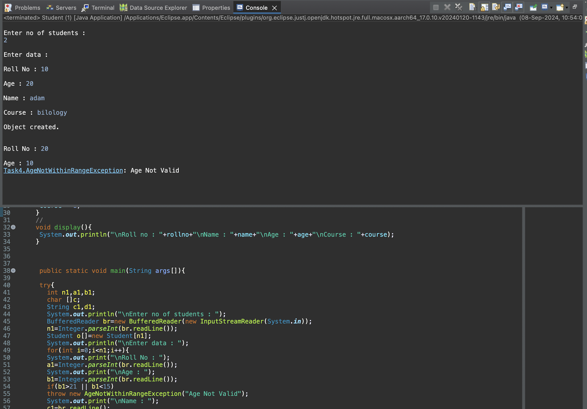</td>
<td>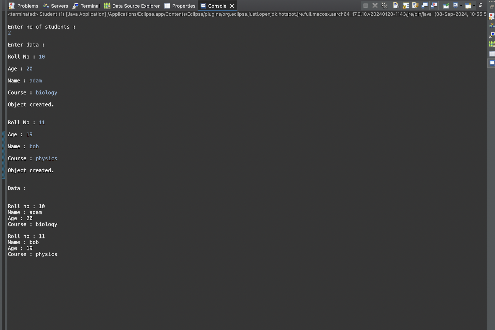</td>
</tr>
<tr>
<td>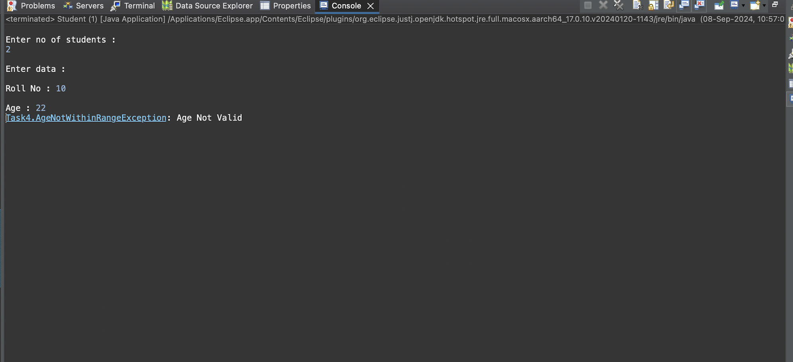</td>
<td>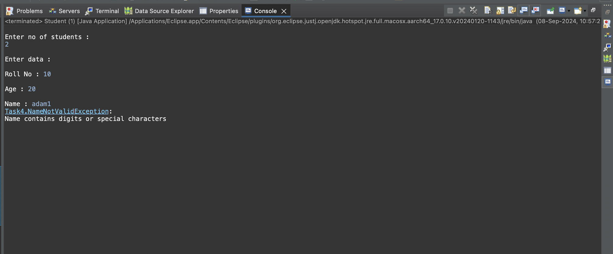</td>
</tr>
</table>

---

### **Q2 — Voter Age Validation**
<table>
<tr>
<td></td>
<td>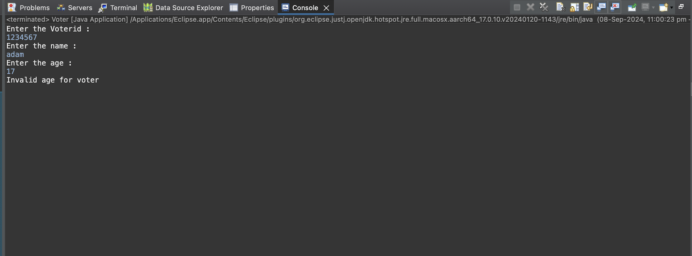</td>
</tr>
</table>

---

### **Q3 — Weekday Array Handling**
<table>
<tr>
<td>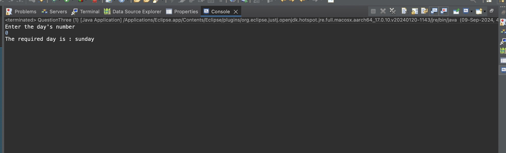</td>
<td>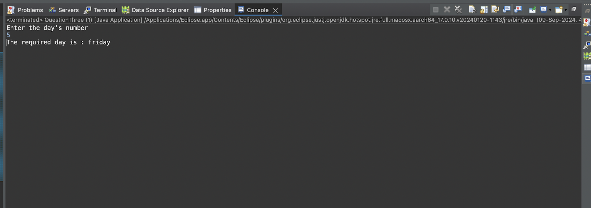</td>
<td>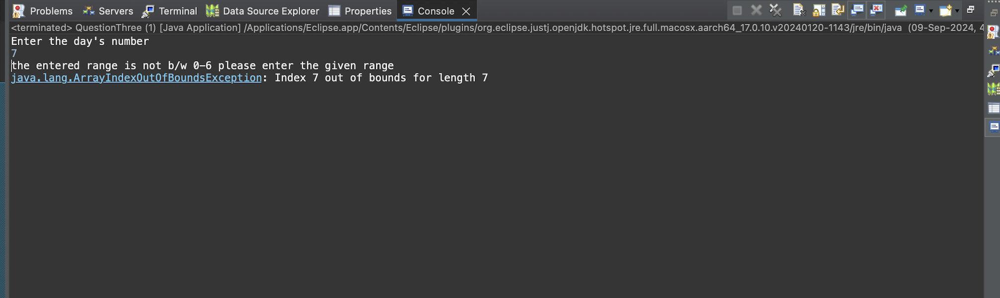</td>
</tr>
</table>

---

### **Q4 — Student Grades (HashMap)**
<table>
<tr>
<td>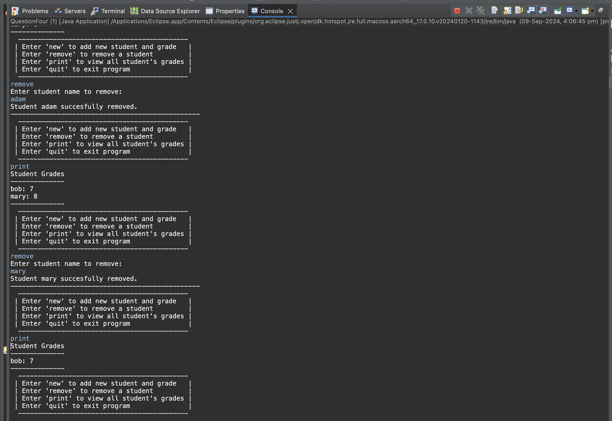</td>
<td>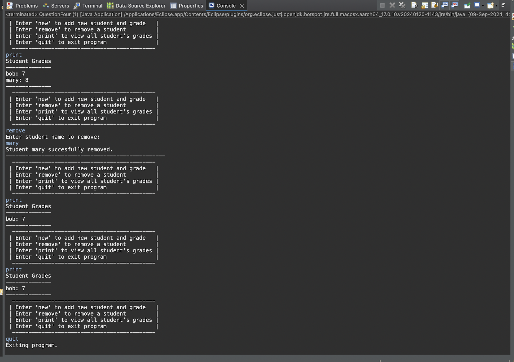</td>
</tr>
<tr>
<td>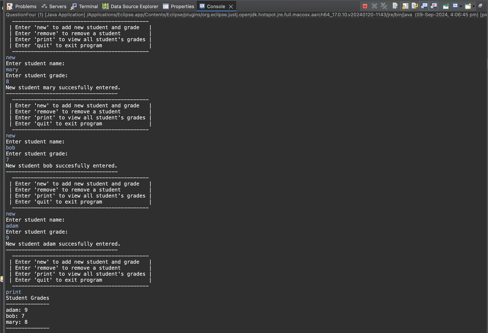</td>
<td>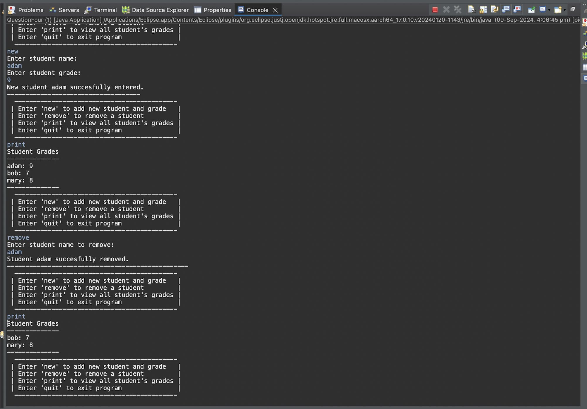</td>
</tr>
</table>

---

### **Q5 — Stack Implementation**
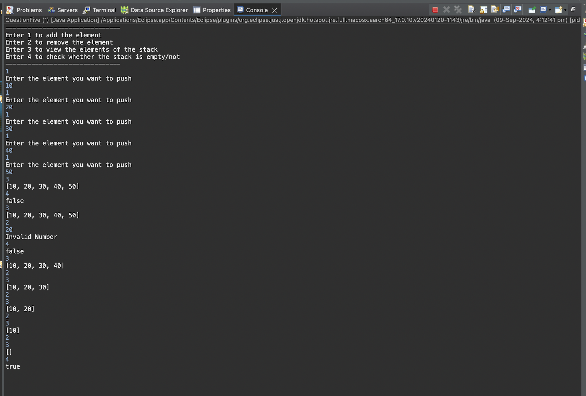

---

## 🧠 Task Breakdown

### **Q1 — Custom Exceptions in Student Class**
- Validates:
  - Age between **15–21**
  - Name must NOT contain digits or symbols
- Uses two custom exceptions:
  - `AgeNotWithinRangeException`
  - `NameNotValidException`

---

### **Q2 — Voter Age Validation**
Ensures voter age is **≥ 18**, otherwise throws a custom exception.

---

### **Q3 — Weekday Array**
- Stores weekday names in an array.
- Handles:
  - Invalid index
  - `ArrayIndexOutOfBoundsException`

---

### **Q4 — Student Grades (HashMap)**
Operations:
- Add student + grade  
- Remove student  
- Print grade by name  

Uses:
```java
HashMap<String, Integer>
```

---

### **Q5 — Integer Stack (Collections)**
Implements:
- `push()`
- `pop()`
- `isEmpty()`

Uses:
```java
Stack<Integer>
```

---

## ▶️ How to Run

```bash
git clone https://github.com/TheComputationalCore/java-advanced-exceptions-collections.git
cd java-advanced-exceptions-collections
javac *.java

# Run tasks:
java Student          # Q1
java Voter            # Q2
java QuestionThree    # Q3
java QuestionFour     # Q4
java QuestionFive     # Q5
```

---

## 📄 License

This project is licensed under the **MIT License**.

